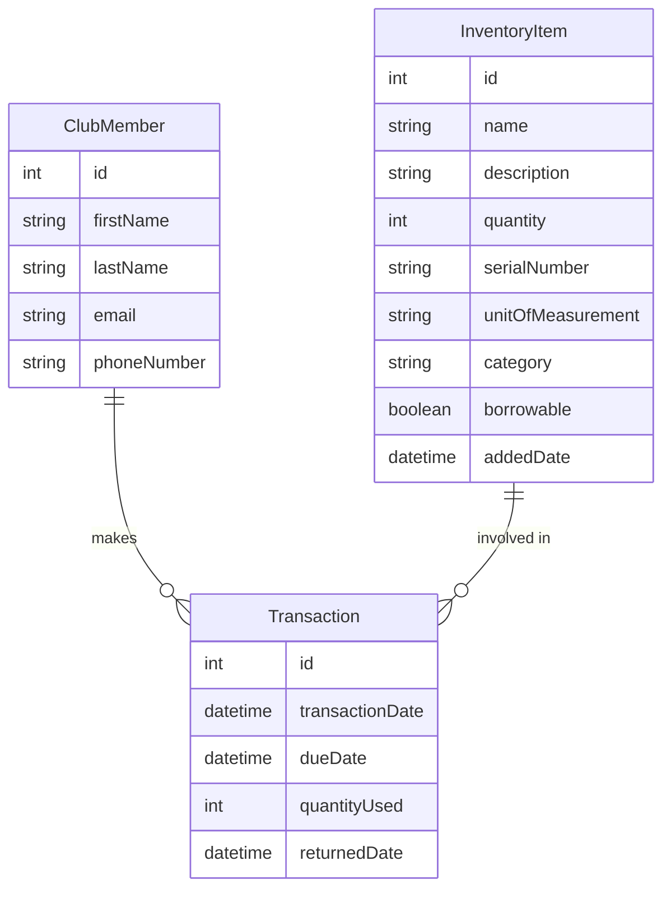

# Inventory System

## Project Summary (Business Perspective)
The Inventory System is designed to streamline and digitalize the management of club or organizational inventory. It allows clubs to efficiently track, lend, and consume items, manage club members, and monitor transactions. The system supports both borrowable items (like equipment) and consumable items (like spare parts), ensuring that all inventory movements are logged and transparent. This reduces manual errors, prevents losses, and improves accountability for resources.

## Project Technological Aspects
- **Backend Framework:** Spring Boot (Java)
- **ORM:** Hibernate/JPA
- **Database:** PostgreSQL
- **Database Migrations:** Flyway
- **Build Tool:** Maven
- **Logging:** Standard Java logging (see `Logger` usage in services). In development, logs are written to a file; in local (non-dev) environments, logs are output to stdout.
- **API:** RESTful endpoints
- **Testing:** Spring Boot Test

## Project Architecture
- **Layered Architecture:**
  - **Controller Layer:** Handles HTTP requests and responses (REST API).
  - **Service Layer:** Business logic, validation, and transaction management.
  - **Repository Layer:** JPA repositories for database access.
  - **Model/Entity Layer:** JPA entities representing DB tables.
  - **DTO Layer:** Data Transfer Objects for API communication.
  - **Configuration:** Application and logging configuration, Flyway setup.

- **Migrations:**
  - All DB schema and seed data managed via Flyway migrations (`db/migration`).

- **Custom Logging:**
  - Logging is achieved by injecting a `Logger` instance into service classes.

## Project Functionalities
- **Club Member Management:**
  - Create, update, delete, and list club members (with first/last name, email, phone).
- **Inventory Management:**
  - Add, update, delete, and list inventory items (borrowable or consumable).
- **Transaction Management:**
  - Record borrow/return transactions for borrowables.
  - Record consumption for consumables.
  - View all transactions and filter upcoming due returns (only for borrowables).
- **Low Stock Alerts:**
  - Identify inventory items below a configurable stock threshold.
- **Database Versioning:**
  - All schema and data changes are versioned and applied automatically.

## Database Structure (E/R Format)
```
[ClubMember] 1---* [Transaction] *---1 [InventoryItem]

ClubMember
- id (PK)
- firstName
- lastName
- email
- phoneNumber

InventoryItem
- id (PK)
- name
- description
- quantity
- serialNumber
- unitOfMeasurement
- category
- borrowable (boolean)
- addedDate

Transaction
- id (PK)
- member_id (FK -> ClubMember)
- item_id (FK -> InventoryItem)
- transactionDate
- dueDate (nullable for consumables)
- quantityUsed
- returnedDate (nullable)
```

## Additional Notes
- **Environment Variables:**
  - `INVENTORY_THRESHOLD` for low stock alerts (default: 10)
  - `config.transaction.reminder-safety-window-days` for due reminders (default: 10)
- **API Docs:**
  - REST endpoints follow standard CRUD conventions for members, items, and transactions.
- **Development:**
  - DB is auto-initialized and seeded by Flyway on startup.
  - `.gitignore` excludes secrets, build artifacts, and IDE files.

---

## API Specification & Sample Requests

### Club Members
- **GET /api/members** — List all members
- **POST /api/members** — Create member
  - Request:
    ```json
    {
      "firstName": "John",
      "lastName": "Doe",
      "email": "john@example.com",
      "phone": "+359888111222"
    }
    ```
- **PUT /api/members/{id}** — Update member
- **DELETE /api/members/{id}** — Delete member

### Inventory Items
- **GET /api/items** — List all items
- **POST /api/items** — Create item
  - Request:
    ```json
    {
      "name": "3D Printer",
      "description": "MakerBot Replicator",
      "quantity": 2,
      "serialNumber": "SN123456",
      "unitOfMeasurement": "pcs",
      "category": "EQUIPMENT",
      "borrowable": true
    }
    ```
- **PUT /api/items/{id}** — Update item
- **DELETE /api/items/{id}** — Delete item

### Transactions
- **GET /api/transactions** — List all transactions
- **POST /api/transactions/borrow** — Borrow item
  - Request:
    ```json
    {
      "memberId": 1,
      "itemId": 2,
      "quantityUsed": 1
    }
    ```
- **POST /api/transactions/consume** — Consume item
  - Request:
    ```json
    {
      "memberId": 1,
      "itemId": 3,
      "quantityUsed": 5
    }
    ```
- **POST /api/transactions/return/{transactionId}** — Return borrowed item

### Stock Alerts
- **GET /api/items/low-stock** — List items below threshold

### Upcoming Due
- **GET /api/transactions/upcoming-due** — List borrowable transactions due soon

---

## Visual Database Diagram



---

## Setup Instructions

1. **Clone the Repository**
   ```sh
   git clone <repo-url>
   cd inventorysystem
   ```
2. **Configure the Database**
   - Ensure PostgreSQL is running on port 5433 (or update `application.properties`).
   - Create a database named `inventory-system`.
   - Set environment variables if needed (e.g., `INVENTORY_THRESHOLD`).
3. **Build and Run**
   ```sh
   mvn clean install
   mvn spring-boot:run
   ```
   - The app will auto-migrate and seed the database via Flyway.
4. **Access the API**
   - Default: `http://localhost:8080/api/`

---

## Contribution Guidelines

- Fork the repository and create a feature branch.
- Follow the existing code style and naming conventions.
- Write tests for new features.
- Ensure all tests pass before submitting a pull request.
- Document new endpoints or features in the README.

---

## Additional Notes
- For a production setup, configure environment variables securely and use a persistent database.
- For questions or feature requests, please open an issue or contact the maintainer.
